# focus-llama

focus-llama: 256k context, ~64k of VRAM, and up to ~35% faster decode than vanilla llama.cpp at the same context depth, by decoupling the physical KV buffer from the context window, offloading old chunks to a store, and recalling them on demand.



*KV buffer for a 200k-token prompt (-c 200000). The prompt text is identical in all three cases and lives in RAM. (A) Vanilla llama.cpp allocates 200k KV cells and fills all of them. (B) Before buffer decoupling, focus-llama still reserves 200k cells, but only the ~30k-token hot window is resident, so most of the allocation sits empty. (C) After decoupling, the physical buffer is capped at 80k cells: the 30k hot window plus 30k of retained headroom and free cells. Evicted text moves to the focus-memory store, is refilled on demand, and its session state is kept as Σ skill.state.*

## How it works
Vanilla llama.cpp allocates a contiguous KV buffer for the full -c (VRAM), and every decode step attends over all tokens currently in context, so per-token cost grows roughly linearly with context length (only the attention part; the weights matmul is constant). The two problems are separate: the allocation wastes VRAM, and the growing context slows decoding.

focus-llama attacks both: the physical buffer is capped (~85k cells) so VRAM is bounded, and since the number of resident cells can't exceed the buffer, per-step attention cost is bounded by the buffer size instead of the logical context length. It based on 2 techniques declarative attention and skill.state, introduced by google deepmind.

## Build

Same as upstream `llama.cpp`. Build the server, plus `llama-bench` if you want the depth benchmarks:

```bash
git clone https://github.com/edwardyoon/focus-llama.git
cd focus-llama

# CUDA (set the architecture of your GPU; "120" below is only an example)
cmake -B build -DGGML_CUDA=ON -DCMAKE_CUDA_ARCHITECTURES="120" -DCMAKE_BUILD_TYPE=Release

# Metal (macOS) or CPU-only
# cmake -B build -DCMAKE_BUILD_TYPE=Release

cmake --build build --config Release -j --target llama-server llama-cli llama-bench
```

## Smoke tests

The smoke tests are quick checks that the server-side mechanisms behave as intended on **one** prompt.
They are not benchmarks and say nothing about accuracy or speed.

All scripts need a server built from this fork. An older `llama-server` silently ignores the extra
request fields, which is why the scripts include checks that fail in that case.

### 1. KV-range removal (`da_rm`)

`da_rm` drops token ranges from the KV cache of a request. With `da_rm_at` the removal is applied
mid-prefill, so the tokens after the boundary (the question) are prefilled without the removed range.
Without `da_rm_at` it is applied after prefill.

```bash
./build/bin/llama-server -m <model>.gguf
python3 da-probe/da_server_smoke.py http://127.0.0.1:8080 [--hybrid]
```

Use `--hybrid` for models with recurrent / linear-attention layers (e.g. Gated DeltaNet). On those models
the text of the fact-removed runs is informational only.

Runs (all use `stop=["\n"]`, exact-match verdicts, and first-token logprobs):

| Run | Request | What it shows |
|---|---|---|
| baseline | no `da_rm` | answers exactly `ZEBRA-42` |
| strict | fact range, `da_rm_at` = question start | removal applied mid-prefill |
| paper | fact range, no `da_rm_at` | removal applied after prefill (decode-time restriction) |
| masked-all | whole document, `da_rm_at` | removal changes the computation |
| control | unrelated section, `da_rm_at` | answer stays `ZEBRA-42` (selectivity) |

Example summary (trimmed):

```
baseline         : PASS (exact 'ZEBRA-42')
mechanism (Δlp)  : baseline vs masked-all first-token Δlp=0.6217 - different prefill computation (mid-prefill removal ran)
selectivity      : PASS (exact 'ZEBRA-42')
path divergence  : strict vs paper first-token Δlp=0.9256 - different prefill paths
OVERALL          : PASS
```

- **mechanism** - first-token logprobs of baseline and masked-all differ, so the removal really changed
  the prefill. Identical values mean it was not applied mid-prefill (check the server log for `da_rm:` lines).
- **path divergence** - `strict` and `paper` must differ, otherwise both took the same path.
- **selectivity** - removing an unrelated section leaves the answer intact.

### 2. Two-stream backend B (`da_b`)

Backend B copies the kept prefix (scaffold + focus) into a reserved second sequence and decodes there.
The original sequence stays intact, so a later return to global attention would not need a re-prefill
(the return path itself is not implemented yet).

Requirements:

- `--kv-unified` is **required**. A partial-range `seq_cp` aborts on a non-unified pool, so without it
  the server falls back to logical removal (`da_rm`) and logs a WARN. The answers would still pass, which
  is why the server log is the real evidence.
- `--parallel 2` is only needed for the cache-integrity phase (phase 2 below).
- Add `-v` to see the per-step read-set lines.

```bash
./build/bin/llama-server -m <model>.gguf --kv-unified --parallel 2 -v
python3 da-probe/da_b_smoke.py http://127.0.0.1:8080 [--hybrid] [--runs k1,k2,...] [--skip-cache]
```

Options:

- `--hybrid` - same meaning as above.
- `--runs` - run a subset of phase-1 keys: `baseline,bkeep,bnofact,logical,bkeep2`.
- `--skip-cache` - skip phase 2.

**Phase 1** (one ZEBRA prompt, `cache_prompt=false`):

1. **mechanism** - `baseline` vs `bkeep` first-token logprobs must diverge. Identical values mean the B
   switch did not run (old binary, missing flags, or fallback).
2. **B equals A** - `bnofact` (B) and `logical` (A, `seq_rm`) apply the same removal by different means,
   so their first-token logprobs must agree within 5e-3 (0.0003 in one run on a local Bonsai-8B).
   A large difference points at a wrong keep set.
3. **answers** - `baseline`, `bkeep` and `bkeep2` must answer exactly `ZEBRA-42`. `bkeep2` is a second,
   consecutive `da_b` request and checks that the reserved sequence id can be reused after the first
   one finished.

**Phase 2** (cache integrity, needs `--parallel 2`): a request caches prompt P1 on one slot, a `da_b`
request runs on the other slot, then P1 is sent again. It must land back on the first slot with its
cache untouched, i.e. a B switch does not destroy another slot's cached prompt.

### 3. Tag parser (`da_chunks`) - the model decides the removal

Instead of the client choosing the ranges, the client sends the chunk *layout* and the model's own
`<focus magic_chunks="N">` tag decides what gets removed:

- `da_chunks` - the prompt token ranges of the document chunks, a list of `[lo, hi)` pairs. Index
  `N-1` is chunk `N` (the tag's number is 1-based).
- `da_filler` - the `[lo, hi)` range of a filler segment, removed together with the non-kept chunks.
  Omit it (or the server treats it as absent) when the layout has no filler.

When the first complete tag appears in the generated text, the server removes every chunk except the
named one, plus the filler, exactly once - via backend B if `da_b` is also set, else backend A. The
removal boundary is the current decode position, so in B mode the already-generated tokens are part of
the kept set. `da_chunks` supersedes a static `da_rm` in the same request. A model that never emits a
complete tag simply runs with full attention - no removal is applied.

The mechanism is **per-request opt-in**: a request without `da_*` fields runs exactly as before and
produces no `da_*` log lines. To use it, the client must build the prompt, tokenize it (e.g. with
`/tokenize`), and attach the resulting layout to the `/v1/completions` body:

```json
{
  "prompt": "<scaffold>\n[Chunk 1] ...\n[Chunk 2] ...\n...\n[Chunk 5] ...\n<filler>\n<instruction>",
  "da_chunks": [[8, 96], [96, 184], [184, 272], [272, 360], [360, 448]],
  "da_filler": [448, 520],
  "da_b": true,
  "max_tokens": 64
}
```

`da_chunks[i]` is the `[lo, hi)` prompt token range of chunk `i+1` (1-based, matching the tag's
`magic_chunks` number). Only the client that assembled the prompt knows these ranges - the server
cannot derive them from the text.

```bash
./build/bin/llama-server -m <model>.gguf --kv-unified --parallel 2 -v
python3 da-probe/da_tag_smoke.py http://127.0.0.1:8080 [--hybrid]
```

The smoke test builds a 5-chunk document (one codeword per chunk) plus filler and instruction. All
three runs (`baseline`, `tag_a`, `tag_b`) must emit `<focus magic_chunks="4">` before answering exactly
`ZEBRA-42`, and the server journal must show the tag close and the removal (`da_tag:` lines).

Note on tag emission: the script prompts raw (no chat template) and primes the model with an empty
closed thinking block (`
</think>

`), which makes small thinking models (e.g. Bonsai-8B) emit the
tag instead of answering straight. On a larger model with the proper chat template this priming should
not be needed.

### 4. DA survives auto-compaction (`da_e2e_compaction`)

The end-to-end check for the production failure mode: a DA session that gets
auto-compacted (the conversation replaced by a summary) must keep retrieving.
The driver sends the real focus-memory hook block shape (a verbatim port of
`buildDaBlock`) and simulates a compaction by replacing the history with a
summary that carries a **dead** marker block, then a new turn with a **live**
block. The marker scanner must tail-anchor to the last user message, ignore
the dead block, and validate the live one.

```bash
./build/bin/llama-server -m <model>.gguf --da-prompt-scan --parallel 1 -c 8192 -v
python3 da-probe/da_e2e_compaction.py http://127.0.0.1:8086 --log /tmp/da_e2e.log
```

Three phases (A: 3 live-block turns, B: summary with a dead block + a new live
block, C: a post-compact turn). PASS requires all five answers CORRECT, 5/5
`da_scan:` journal lines with chunk ranges 1..5 → 21..25, and 0 fail-open
lines. The Phase B line is the money check: the compacted prompt was scanned
(not failed open) and the live block won over the dead summary block.

### Reading the server log

```bash
grep 'da_b:' <server log>                 # or: journalctl -u <service> | grep 'da_b:'
grep 'da_tag:' <server log>               # tag parser: request start + tag close / removal
grep 'falling back to logical removal' <server log>    # must be empty for B runs
```

Per B request the server logs:

- `da_b: switched decode to seq N (...) - logical read set now X of Y prefix token(s) (Z removed, -P%)`
- one `da_b:   keep [lo, hi) n token(s)` line per kept range
- with `-v`, per-step `da_b: decode #p: logical read set X of Y ...` lines
- a final `da_b: finished on seq N - final logical read set ...` summary

**These numbers are logical, not measured reads.** In the unified KV pool the removed cells stay in place
and are masked, so the attention still scans the same cell range. Whether fully masked chunks are actually
skipped depends on the backend and the attention kernel (for example, single-token decode on CUDA does not
skip them), and no byte count is logged. Treat the percentage as the size of the attended token set, not as a
speed-up; the measured physical read reduction is in *Verified: physical KV read reduction* above.

## Relationship to focus-memory

[focus-memory](https://github.com/edwardyoon/FocusMemory) chunks and indexes long-term context. `focus-llama` is the inference-side counterpart: it lets the model read a compact index in `global` mode and then commit attention to specific chunks. It **requires a kv chunks store** as a hard dependency - the external, storage-only KV store (the focus-memory one, reached via `--focus-memory-host`) that receives evicted chunk text and serves it back verbatim on refill.

There are two ways to get a chunk layout onto the wire:

1. **Marker path (`--da-prompt-scan` + client markers).** focus-memory assembles the
   prompt from its own chunks and wraps them in `[[da:N]]` ... `[[da:layout:N]]` markers (the
   legacy `<da:N>` form is accepted as well; the hook emits the bracket form because angle
   brackets get mangled by markdown/HTML escaping between the hook and the rendered prompt). The
   server scans the rendered prompt, maps the markers to token ranges, and the model's
   `<focus magic_chunks="N">` tag decides which chunk the next tokens attend to. The marker block
   sits at the prompt tail, so DA only touches the injected memory index - the rest of the
   conversation is untouched. The scanner **tail-anchors** to the last user-message boundary, so a
   marker block that a compaction summary reproduces in the history is ignored (fail-open) and a DA
   session keeps working after auto-compaction - see *Verified: DA survives auto-compaction*.
   Because it never touches the conversation (only the injected index), it cannot corrupt the
   session - but it also cannot reduce the conversation's KV, so it is an index-scoped
   complement to the auto path, not a replacement for it.
2. **Auto-chunking (`--da-auto`, the production path for physical reduction).** The server
   splits the rendered chat prompt itself into ~`--da-chunk-tokens` magic chunks (hard cap
   5/4 × target), packing across message boundaries and falling back paragraph → line → sentence
   → clause → word when a message has too few boundaries, so the client sends a plain request
   with nothing extra. Because it re-chunks the *entire* conversation (system + history + tool
   I/O) on every turn once the prompt passes `--da-min-ctx`, it is the path that produces
   conversation-level, physical KV read reduction - the marker path only ever scopes the injected
   index. It requires `--kv-unified` (backend B) since the A path is irreversible. Known
   limitations, observed in production and under stabilization (see
   `plans/focus-llama-da-stabilization.md`):
   - **Tag-quote hijack.** The tag state machine operates on the model's whole output stream; when
     the model *quotes* a DA tag in its reasoning (debugging DA, quoting a commit message), the
     parser can consume the quote as a control tag, causing an unintended mode switch and a gap in
     the output text. Fixed in v1.0 (line-start-only entry tags, `632e31c20`): a tag quoted
     mid-line is data, not a control tag.
   - **Bigger blast radius than the marker path.** A misfired tag restricts the session's own
     conversation, not just the injected index.

The two paths coexist (marker layout wins when present; auto takes over otherwise - see
Production launch). Without either, requests run with full attention - the two projects remain
independently usable.

## kv-offload (lossless evict/recall, auto-compaction alternative)

`--fm-offload` provides a **lossless** evict/recall cycle backed by an external store (the
[focus-memory](https://github.com/edwardyoon/FocusMemory) storage-only KV store) as the alternative to
the client's lossy auto-compaction: it does not disable the client's compaction, it changes
what an eviction costs (a 1-token re-prefill) and how a chunk comes back (the original text,
not a summary). When a rendered prompt exceeds `--kv-offload-threshold` tokens, the engine
evicts the oldest *middle* messages (never the system message or the last user message) before
`--da-auto` re-chunks: each evicted message's text is PUT to the store. Two modes control what
"evict" does to the KV:

- **`--kv-offload-holes` (production path)** - the evicted text *stays in the prompt*; the
  engine cuts its KV out of the main sequence (`seq_rm` holes, positions not re-based) once the
  prefix is known to exist. The client keeps sending the full prompt, so every re-request
  re-matches at `n_past = full` and re-prefills **1 token** instead of the evicted tail
  (~64 s → ~2 s at production scale). Holes are applied per range (disjoint, validated `hi <= n_past`),
  `release()` keeps the prompt cache, and the generic KQ -inf mask covers the holes - the same
  physical state the DA A path runs in production. The R1 gate (an MROPE mid-sequence hole
  behaves like -inf masking) passed on the production 27B with answer-token Δlogprob
  +0.000 nats. Mid-sequence holes are legal on non-MROPE models too - the batch position
  check only requires the next token at `seq_max + 1`, so a hole in the middle does not
  break contiguity (verified in the local smoke, *Verified* section above).
- **default** - the evicted range is removed from the prompt and the segment becomes a
  **virtual chunk** numbered `M+1..M+K` (after the `M` active chunks) listed in the DA
  instruction; when the model emits `<focus magic_chunks="N">` for an offloaded chunk, the
  engine GETs its text back and re-prefills it at the tail of the sequence (get-on-focus) so
  the model reads the original content - not a compaction summary.

Any store error fails open (the segment stays in the prompt), so a downed store degrades to a
normal DA session, never to data loss. The cycle is complementary to both DA layout paths: it
decides *which* middle messages leave the KV and *how* to bring one back on demand; `--da-auto`
still owns the re-chunking. It requires `--da-auto` + `--kv-unified` (the eviction runs inside
the auto-chunk gate) and a store reachable at `--focus-memory-host`.

**High/low watermark (hysteresis, holes mode).** With the plain gate, a session that has
crossed the threshold re-runs the evict plan + store PUT + hole re-apply on *every*
subsequent turn - each run shaving only the per-turn increment, so the planning/refill
cost repeats for the life of the session. `--kv-offload-high` turns the gate into a
high/low watermark cycle:

- **High (the trigger).** The gate measures the session's **KV-resident** count - the
  full logical prompt minus the *cumulative* evicted, from the per-session PUT ledger
  (the same source `GET /kv_state` reports). Holes mode keeps the evicted text in the
  prompt, so the raw token count overstates the resident; only the resident is the gate.
  When `resident >= --kv-offload-high`, the engine runs **one** evict cycle: it plans the
  oldest middle messages, PUTs them, and hole-punches the KV down to the **low target**
  (`--kv-offload-threshold`, plus `--kv-retain-tokens` when set) in a single shot.
- **Idle band (low < resident < high).** While the resident sits between the two
  watermarks the gate does nothing: no evict plan, no PUT, no hole re-apply - zero
  per-turn work. The already-cut holes persist in the KV (the `kv_hole_ranges` ledger,
  never re-derived from an evict plan), so the resident stays low; recall of offloaded
  chunks is unaffected because the Sigma anchor (the offloaded-chunks note) is fetched on
  the *cumulative* evicted, not the current turn's. The buffer-cap check still runs on
  idle turns, so a store-down / pin overflow is still caught.
- **Re-arm.** As the conversation grows past the low target, the cycle simply waits for
  the high watermark again - each crossing costs one drain, not one per turn.

The low watermark is a **stop target, not a trigger** - eviction never fires below the
high. `--kv-offload-high 0` (the default) keeps the legacy per-turn gate, so the
watermark is an explicit opt-in. It is **holes mode only**: the default (Option C) mode
needs the evict plan on every request to shrink the prompt text itself, so there is no
band to wait in - with `--kv-offload-holes` off the server warns at startup and ignores
the flag. Startup validation also refuses `--kv-offload-high < --kv-offload-threshold`,
and with a `--kv-cache-size` set requires `high + n_batch + gen tail <= kv_cache_size -
16384`: a request sitting just below the high watermark (the idle band's worst case)
must still fit the buffer before eviction can trigger.

**Status: verified (v2.0)** - see *Verified: lossless evict/recall* above.
Running in production (qwen3.8-27B MROPE, `-c 200000 --kv-offload-threshold 38672`,
since 09-26) with `--kv-offload-holes`: evictions PUT to the store and holes cut the KV on
every turn of a live session. The watermark gate (`--kv-offload-high`, `b98be7033`) is
verified by the startup checks (high < low refused, over-cap refused with the allowed max
shown, non-holes warned and ignored) and the multi-turn journal: `kv_offload: gate`
carries `resident=`/`high=` every turn, `kv_offload: watermark idle` marks the band
turns, and `kv_offload: evict plan` appears only on the crossing turn.

> **Flag naming.** The engine flag is `--fm-offload` (env `LLAMA_ARG_FM_OFFLOAD`), not
> `--kv-offload`: the stock llama.cpp `-kvo/--kv-offload` flag (KV-cache offloading) already
> owns that name and the `LLAMA_ARG_KV_OFFLOAD` env var, so a `--kv-offload` here would be
> silently consumed by the stock flag and eviction would never engage.

## Production launch (recommended options)

The production node runs the DA inference service - qwen3.8, multimodal - behind the
focus-memory backend. The recommended `llama-server` launch line is:

```bash
llama-server \
  --parallel 1 \
  --metrics \
  --da-auto \
  --kv-unified \
  --da-min-ctx 2048 \
  --da-chunk-tokens 4096 \
  --sparse-gate-threshold 60 \
  --spec-type draft-mtp-adaptive \
  --spec-draft-n-max 4 \
  --spec-draft-ngl all \
  --kv-cache-size 115536 \
  --fm-offload \
  --kv-offload-holes \
  --kv-offload-threshold 38672 \
  --kv-offload-high 55000 \
  --kv-retain-tokens 6000 \
  --focus-memory-host http://<store-host>:3900 \
  --focus-memory-token <CONTEXT_API_TOKEN>
```

(`--da-auto` is the production path: it re-chunks the whole rendered prompt, so DA restricts
attention over the *entire* conversation - which is what makes the physical KV read reduction
real (see *Scope of the effect* below). It requires `--kv-unified` (backend B): the A path is
irreversible, so a wrong focus would permanently delete the answer chunk. The
post-compaction drift item (tag-quote hijack) was fixed in v1.0 (line-start-only entry
tags); residual items are tracked in `plans/focus-llama-da-stabilization.md`. A client that
also injects focus-memory markers can add
`--da-prompt-scan`; the marker layout then wins per request when present.)

(`--parallel 1` keeps the node single-tenant; with `--kv-unified` present it runs backend B - see
Backend A vs B below.)

| Option | What it does | Why it is on |
|--------|--------------|--------------|
| `--metrics` | Exposes Prometheus metrics on the server port | Observability for a long-running service |
| `--da-auto` | **Auto-chunking**: when a rendered prompt has no client layout markers and is at least `--da-min-ctx` tokens, the server splits it into magic chunks by message boundaries so the model's `<focus magic_chunks="N">` tags can restrict attention over the whole conversation | Production path for **physical** KV read reduction - re-chunks system + history + tool I/O, not just an injected index |
| `--kv-unified` | Enables backend B (reversible two-stream KV) | Required by `--da-auto`: the A path (`seq_rm`) is irreversible, a wrong focus permanently deletes the answer chunk |
| `--da-min-ctx 2048` | Minimum prompt length (tokens) before auto-chunking engages | Short prompts stay full-attention (no DA overhead); default is 0 (always) |
| `--da-chunk-tokens 4096` | Target magic-chunk size (tokens); hard cap 5/4 × target | Production chunk size (default 2048); larger = fewer, coarser spans |
| `--da-tail-keep 8192` | **DA tail floor**: the most recent N tokens before the removal boundary are always kept in the DA keep set (the union of the tag selection, the Sigma anchor and the tail), so the work in progress survives a B switch even when no magic_chunks tag covers it. 0 = legacy behavior (no floor) | Default 8192: without the floor, the region the model was just working in (not covered by any magic_chunks tag) is masked out whole at a B switch and the model forgets what it just did; the floor trades part of the read reduction for keeping that tail readable |
| `--sparse-gate-threshold 60` | **DA sparse FA gate**: the sparse (gather) attention path is used only while the finite KV rows are at most 60% of the cache, dense below that (1-100, default 50) | Default 50 would run dense in the production steady state (threshold + retain ≈ 44.7K of 85536, ~52%); 60 keeps the sparse path engaged there, and it still flips to dense once finite rows pass 60%, where the gather overhead would not pay off |
| `--spec-type draft-mtp` | **Speculative decoding** with the model's MTP draft head | Speed-up on top of DA. Spec and DA **coexist**: while a slot is in DA mode (`da_seq` active) spec is paused automatically and resumes on the return to global attention - so spec stays ON without breaking DA |
| `--spec-draft-n-max 4` | Up to 4 draft tokens per step | Enough to overlap decode with drafting, without so many that rejections waste work |
| `--spec-draft-ngl all` | Puts the whole draft model on the GPU | The draft model is small; keeping it fully on-GPU avoids CPU round-trips that would erase the spec gain |
| `--kv-cache-size 85536` | Physical KV buffer size in cells; decoupled from the logical position range - cells wrap while positions extend to `-c` (0 = default: n_ctx_seq) | Sized for the watermark worst case - high + n_batch + gen tail + 16384 headroom (60000 + 2048 + 16384 = 78432 ≤ 85536, enforced at startup) - so a request sitting just below the high watermark still fits before eviction can trigger; an over-buffer request is rejected before a find_slot failure |
| `--fm-offload` | **kv-offload**: evict the oldest middle messages to the focus-memory store once the prompt exceeds `--kv-offload-threshold`, and re-prefill them on demand when the model focuses an offloaded chunk | Replaces lossy auto-compaction with a lossless evict/refill cycle (see *kv-offload* above). Optional - off by default |
| `--kv-offload-threshold 38672` | Token count at which kv-offload eviction engages (the **low** watermark when `--kv-offload-high` is set - the drain target, not a trigger) | Size it at ~8-9 × `--da-chunk-tokens` (4096 → 38672): high enough that short sessions never evict, low enough that eviction engages long before the client's auto-compaction point, so the prompt stays a few chunks over the threshold instead of ballooning |
| `--kv-offload-high 60000` | kv-offload holes-mode **high watermark**: the only eviction trigger - when the session's KV-resident (full prompt minus cumulative evicted) reaches 60k, drain to the low target (`--kv-offload-threshold` + `--kv-retain-tokens`) in one shot; between low and high the gate is idle (no per-turn plan/PUT/hole work). 0 = legacy per-turn gate | Without it a session past the threshold re-runs the evict plan + PUT + hole re-apply every turn, shaving only the per-turn increment; the watermark makes each crossing cost a single drain. Sized under the buffer cap: `high + n_batch + gen tail <= 85536 - 16384` (60000 + 2048 fits, verified at startup) |
| `--kv-retain-tokens 6000` | kv-offload: minimum recent tokens kept in the KV cache beyond `--kv-offload-threshold` when evicting (0 = evict down to the threshold only; default 0) | Keeps the active tail resident after each eviction so the hottest context never goes to the store; the buffer is sized to honor it, so retain is never clamped (see `--kv-cache-size`) |
| `--focus-memory-host` | Base URL of the focus-memory KV store (`PUT`/`GET` `/v1/kv-offload/chunk`) | Empty = kv-offload disabled even with `--fm-offload` on (fail-open) |
| `--focus-memory-token` | Bearer token for the store API (`CONTEXT_API_TOKEN`) | Empty = no auth header; set it to match the store |

**Scope of the effect.** The two paths are not two settings of the same effect. The marker
path restricts attention only over the client-declared marker region (the focus-memory index
at the prompt tail); the rest of the conversation - system, history, tool I/O - is scaffold
and always keeps full attention. Its read reduction is therefore bounded by the size of the
injected index, and a prompt with no markers gets no DA at all (fail-open, full attention).
`--da-auto` is the opposite: it re-chunks the *whole* rendered prompt (system + history + tool
I/O) and can attend to a single chunk of it - which is why the recommended line above runs it,
and why it is the path that produces conversation-level, physical KV read reduction.

**Two layout paths, one priority.** `--da-prompt-scan` (marker path) and `--da-auto` (server path)
are independent and can both be on. Per request the server first scans for a client-provided marker
block; if that yields a valid layout it wins, and auto-chunking is skipped for that request. If the
scan finds nothing (no markers, or malformed markers that fail open), auto-chunking takes over for
prompts at or above `--da-min-ctx`. So a node can serve both marker-aware clients and plain
OpenAI-compatible clients with the same launch line.

Both paths fail open to vanilla (full attention) on any mismatch - a wrong layout must never
restrict attention to the wrong ranges. The auto path tolerates bounded tokenizer drift (up to 1%
of the text length) when mapping the headers it inserted itself, because large rendered prompts
(50K+ tokens with repeated content) do not round-trip tokenization exactly; drift beyond that
still fails open.

**Backend A vs B.** The focus/local restriction runs on backend A (`seq_rm` holes, monotonic - a removal
is irreversible within the request and a return to global attention needs a re-prefill) or backend B
(two streams, reversible, no re-prefill), selected by `--kv-unified`. Note that `--kv-unified` is
**implied by `--parallel`**: when `--parallel` is left at its default (auto), the server sets
`n_parallel=4` **and** `kv_unified=true`, so DA runs on backend B. To run backend A instead, launch with
an explicit `--parallel` (e.g. `--parallel 1`) and without `--kv-unified`. Confirm which backend a
request used from the scan log: `da_scan: ... - A path` vs `da_scan: ... - B path`.

**Verifying DA in the journal.** After a chat that carries DA markers, confirm the DA path ran:

```bash
journalctl -u qwen3.8-focus --since "10 min ago" | grep -E 'da_scan:|da_auto:|da_tag:|kv_offload:'
```

- `da_scan:` - the prompt scanner found the `[[da:N]]`/`<da:N>` markers and built the chunk-to-range map (marker path)
- `da_auto:` - auto-chunking split the prompt (the recommended production line runs `--da-auto`)
- `da_tag:` - a `<focus>`/`<local>` tag was parsed and the attention restriction applied
- `kv_offload: gate` - kv-offload engaged for the request: logs threshold, retain/target, buffer, raw token count, the KV-resident count (`resident=`), the high watermark (`high=`; 0 = legacy per-turn gate), store host, and session - one line per turn
- `kv_offload: watermark idle` - a holes-mode turn inside the watermark band (`resident < high`): no evict plan, PUT, or hole work this turn; the already-cut holes persist
- `kv_offload: evict plan` / `PUT ok` / `evicted N segment(s)` - the eviction sequence: the plan, each successful store PUT, and the KV cut (holes mode) or prompt shrink (default mode); with the watermark on, only on the turn the resident crosses the high watermark
- `kv_offload: get-on-focus` / `GET ok ... re-prefilling` - the model focused an offloaded chunk and it was fetched + re-prefilled at the tail
- `kv_offload: disabled` (one-time warning) - `--fm-offload` was not parsed or `--focus-memory-host` is empty, so eviction can never engage

A chat with no markers and a prompt below `--da-min-ctx` produces no `da_scan:`/`da_auto:` line
and runs with full attention - that is the intended fail-open behavior. On a node running
`--da-auto`, a markerless prompt at or above `--da-min-ctx` produces a `da_auto:` line instead.

**Verifying DA end-to-end with curl.** Send a chat whose user message carries a well-formed marker
block (the same format the focus-memory hook injects) and read the `timings` object of the response:

```bash
curl -s http://127.0.0.1:8080/v1/chat/completions -H "Content-Type: application/json" -d '{
  "model": "qwen27b",
  "messages": [{"role": "user", "content": "Memory entries:\n[[da:1]]The capital of France is Paris.\n[[da:2]]The capital of Germany is Berlin.\n[[da:filler]]Instructions (Declarative Attention): The memory entries above are numbered magic chunks (1-2). First identify the chunk that contains the answer to the question, and output the tag <focus magic_chunks=\"N\"> on its own line, where N is the chunk number (1-2). Then answer the question.\n[[da:layout:2]]\nQuestion: What is the capital of France?"}],
  "max_tokens": 160, "temperature": 0, "stream": false
}' | python3 -c "import sys,json; d=json.load(sys.stdin); print(d['choices'][0]['message']['content']); print({k:v for k,v in d['timings'].items() if k.startswith('da_')})"
```

How to read the result:

| Signal | Meaning |
|--------|---------|
| `timings.da_n_restricted_steps` > 0 | The model emitted a `<focus>`/`<local>` tag and the server ran the restricted-attention steps |
| `timings.da_n_attended_tokens` | Logical tokens attended per restricted step (sum over steps) - the reduction vs. the full prompt is the DA effect. **Logical, not physical** reads |
| `timings.da_path` = `A` / `B` | Which backend enforced the restriction (see Backend A vs B above) |
| `timings` has **no** `da_*` fields | Either the prompt had no valid marker block (fail-open vanilla) or the model never emitted a tag - check the journal `da_scan:`/`da_tag:` lines to tell which |
| `choices[0].message.content` | The model's answer. The `<focus ...>` tag is erased from the text; depending on how the tokens streamed it may or may not be visible to the client (accepted as v1 behavior) |

Expected outcomes per prompt shape:

- **Well-formed markers** (`<da:1>...<da:2>...<da:filler>...<da:layout:2>`) - journal shows
  `da_scan: 2 chunk(s) numbered 1..2 + filler ... - A path` followed by
  `da_tag: request start - 2 chunk(s)`, and (if the model commits to a chunk)
  `da_tag: <focus magic_chunks="N"> closed at generated token ... - A removal, ... range(s)`.
  A 500 / `substr` exception after a `da_tag:` line means the text-accounting broke - that is a bug.
- **No markers** - no `da_scan:` line at all, no `da_*` in `timings`, output identical to a vanilla
  server. This is the regression guard: unmarked traffic must be untouched.
- **Malformed markers** (e.g. footer says 3 but only 2 `<da:N>` markers) - journal WARN
  `da_scan: last block has 2 chunk marker(s) but the footer says 3 - failing open to vanilla`,
  no `da_*` in `timings`.

The `system_fingerprint` in the response carries the server's git short hash
(`b11090-88db36bc5` = commit `88db36bc5`) - use it to confirm which binary a node actually runs.

## License

MIT, following upstream `llama.cpp`.
